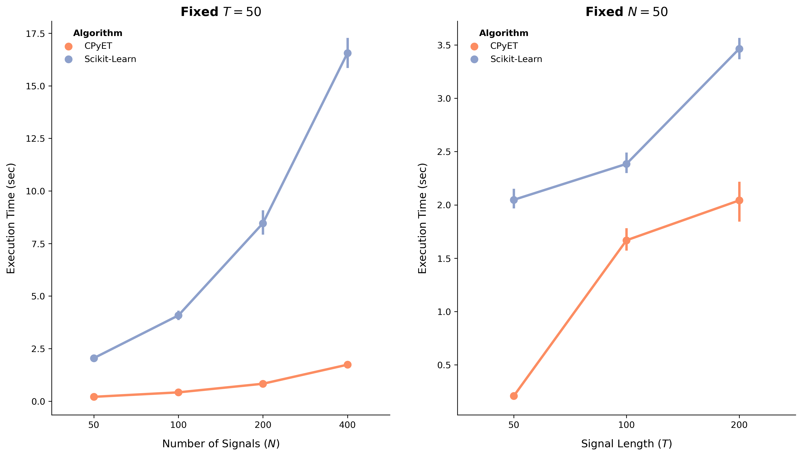

# Gaussian Process De-Trending Benchmark Summary
To compare the radial basis function (RBF) Gaussian process (GP) de-trending 
implementation developed in the CPyET package with the algorithm provided by Scikit-Learn,
we investigated the effect of signal length, $T$, and the number of signals, $N$.
We evaluated the computation time for the CPyET implementation versus the 
Scikit-Learn algorithm at $N = \{100, 200, 400\}$ for a fixed value of T = 50.
Similarly, for a fixed $N = 50$, we compared the computation time between CPyET 
and Scikit-Learn at $T = {50, 100, 200}$.
We computed 95% bootstrap confidence intervals for the execution times.

## Results Discussion
Overall, the CPyET implementation was significantly faster than the Scikit-Learn implementation.
Key takeaways from the results include:

* The performance difference between CPyET and Scikit-Learn becomes more 
pronounced as the sample size increases.
* While CPyET was faster for a fixed $N = 50$, the effect of signal size ($T$) was not as substantial. 
This can be attributed to the solution approach involving Cholesky factorization and memory management.
* Both implementations provide reasonable computation times for the de-trending application. 
Since de-trending is a one-time event, the difference between completing the 
task in two seconds versus 20 seconds is negligible compared to the rest of 
the computational pipeline.

## CPyEt Implementation Notes
* We observed that running the function `_detrend_all_signals_gp_numba` in a 
for-loop multiple times led to computational explosion, 
particularly when increasing $T$.
Although this is not a realistic use case (as these functions are one-and-done applications),
it may be indicative of poor memory management.
* While the CPyET version is faster, it requires compilation of certain functions, 
which took approximately one to two seconds in our experiments. 
For larger datasets, the compilation time is likely worth it, but it's an aspect to consider.
* Scikit-Learn is likely more rigorously tested than our implementation. 
If numerical stability is of utmost importance, we recommend using the Scikit-Learn version.
